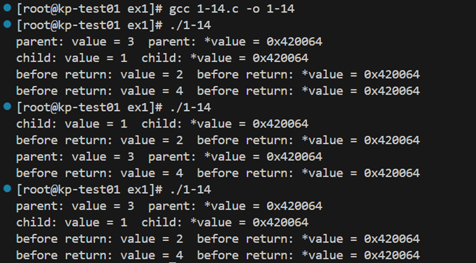
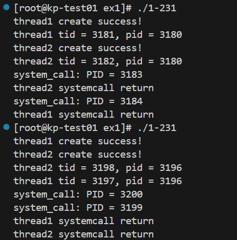

## 1.1进程相关编程实验 
### 步骤1

#### 运行结果：

#### 结果分析：
调用`fork()`创建一个子进程。

父进程中，`pid`返回子进程的进程号，`pid1`为父进程的进程号；子进程中，`pid`返回0，`pid1`返回子进程本身的进程号。

调用了`wait()`，父进程会等子进程结束后再结束。

（`wait()`运行时父进程已经打印了输出结果，所以其实父子进程间的打印顺序应该是随机的，但是我运行的时候并没有跑出父进程先于子进程打印的输出结果，猜测可能是因为子进程代码少，所以执行速度更快。）

### 步骤2

#### 运行结果：

#### 结果分析：

`wait()`会暂时停止目前进程的执行，直到有信号来到或子进程结束。

删去`wait()`函数后，父进程不会等待子进程结束，它将会和子进程同时运行。因此，父进程和子进程的打印顺序是不确定的。而且如果父进程先于子进程结束，子进程会变成孤儿进程，此时子进程将立刻结束。

### 步骤3

#### 运行结果：

#### 结果分析：
增加全局变量`value`，在父进程中修改`value`值为3，子进程中修改`value`值为1，分别打印`value`的地址与值。观察到，父子进程打印的值不同，但地址是相同的。因为`fork()`后子进程和父进程的数据空间是独立的，不同进程中`value`的修改互不影响。但在父进程和子进程中，指针p所指的地址是一样的，因为`fork()`会复制整个地址空间。

### 步骤4

#### 运行结果：

#### 结果分析：
在`1-13`的基础上，在return前对全局变量`value`加1。父子进程都会执行这个操作，而且由于`fork()`后子进程和父进程的数据空间是独立的，所以不同的加1操作互不影响。子进程的`value`从 1 增加到 2，父进程的 `value`从3增加到4。

父进程和子进程间执行加1操作的顺序是随机的，但进程内部需要先进行赋值，再进行加1操作。因此，父子进程的打印顺序不确定，但进程内部的打印顺序是确定的。

### 步骤5

#### 运行结果：
调用`system`函数：

调用`exec`族函数：

#### 结果分析：
在子进程内部分别使用`system()`和`execvp()`函数调用`system_call.c`输出进程号，与直接调用`getpid()`获得的进程号对比。观察到`execvp()`输出的进程号是子进程的`pid`，而`system()`输出的进程号并非子进程的`pid`。同时，调用`execvp()`函数后，进程不会继续执行接下来的输出。

这是因为`system()`会新创建一个子进程来执行指定的命令，其`pid`与原先的进程不同；而`execvp()`是一个进程替换函数，它会替换当前进程的映像，并用新程序的映像来覆盖现有的进程，所以`execvp()`输出的进程号与原先的进程相同。

## 1.2线程相关编程实验
### 步骤1

#### 运行结果：

#### 结果分析：
创建两个子线程，在不设置线程锁和信号量的情况下，分别对全局变量`shared_var`进行100000次+100和-100操作。在没有竞争的理想情况下，预计输出结果为0，但实际输出非0，这是因为两个线程间可能并发访问相同的内存，比如全局变量`shared_var`，从而造成数据竞争。

### 步骤2

#### 运行结果：

#### 结果分析：
使用信号量来保证两个线程不会在没有协调的情况下同时访问和修改`shared_var`。对于线程`increment`，每次循环开始，首先执行P 操作，如果 signal 值为 1，则 P 操作成功，线程进入临界区，并将信号量值减至 0。
临界区操作完成后，V 操作将信号量的值加回 1，释放临界区。线程`decrement`与`increment`线程类似。

信号量保证了每次只有一个线程可以访问和修改全局变量`shared_var`，从而避免了数据竞争。

### 步骤3

#### 运行结果与分析：

两个线程的TID不同，因为每个线程都有自己的TID；PID相同，因为两个线程属于同一个进程。调用`system()`函数输出进程的PID，发现PID不同，因为`system()`会新创建一个子进程来执行指定的命令。

调用`execvp()`时，观察到输出不完全。因为调用 `execvp()` 会导致当前线程的代码空间被替换，主进程剩余的代码不会被继续执行。所以，只要有一个线程开始执行`execvp()`，新进程将会覆盖原先的进程，另一个线程也不会继续执行原先的代码。

## 1.3自旋锁实验

#### 运行结果：

#### 结果分析：

自旋锁的设计是为了防止多个线程在同时访问`shared_value`时发生数据竞争。如果没有自旋锁，两个线程可能会同时读取 `shared_value`，并各自进行+1或-1操作，而这时会造成数据冲突，从而导致最终结果错误。

增加自旋锁后，每次只能有一个线程访问共享资源，因此两个线程在操作共享变量时不会发生数据竞争，从而正确地修改 `shared_value`。

