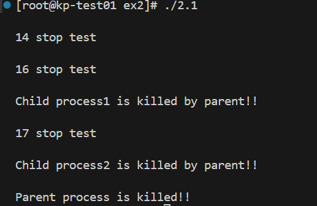

### 2.1 进程的软中断通信
#### 运行截图
##### ctrl+c 发送 SIGINT信号

##### ctrl+\ 发送 SIGQUIT信号

##### 不发送中断信号

##### 父进程向子进程发送闹钟信号

#### 结果分析
##### 在接收不同中断前后的差别
SIGINT或SINQUIT信号未触发时，子进程处于`pause`，父进程等待中断信号或超时信号。
中断信号触发后，父进程向两个子进程分别发送信号SIGSTKFLT和SIGCHLD子进程从`pause` 中唤醒，执行信号处理程序，完成资源清理并退出。

##### 改为闹钟中断后，程序运行的结果是什么样子？与之前有什么不同？
1. 父进程向子进程发送SIGALRM信号
    将父进程通过 SIGUSR1 和 SIGUSR2 通知子进程的逻辑替换为使用闹钟信号 (SIGALRM)。子进程通过SIGALRM来接受父进程的中断通知。收到中断信号时，父进程通过 `kill(pid, SIGALRM)` 通知子进程退出。
    修改前，子进程能明确知道收到的中断信号是 SIGUSR1（父进程发给子进程1）还是 SIGUSR2（父进程发给子进程2）。修改后，子进程无法区分具体来自父进程的哪个通知，只能统一处理SIGALRM。

2. 父进程被SIGALRM信号中断
    父进程收到SIGALRM信号后，子进程直接被 SIGKILL 强制终止	；父进程收到SIGINT/SIGQUIT信号后，子进程通过 SIGUSR1/SIGUSR2 通知退出。

##### kill 命令在程序中使用了几次？每次的作用是什么？执行后的现象是什么？
`kill()` 命令被使用了两次。
1. 接收到中断信号
    父进程在捕获 SIGINT 或 SIGQUIT 信号时，发送 SIGSTKFL 信号给 pid1 对应的子进程 1；发送 SIGCHLD 信号给 pid2 对应的子进程 2。
    子进程 1 捕获到 SIGSTKFL 信号后，执行 `handle_usr1()` 函数，打印 16 stop test；子进程 2 捕获到 SIGCHLD 信号后，执行 handle_usr2() 函数，打印 17 stop test。

2.  超时，父进程强制结束子进程
    当超时发生（5秒后，父进程收到 SIGALRM ），发送 SIGSTKFL 信号给 pid1 对应的子进程 1；发送 SIGCHLD 信号给 pid2 对应的子进程 2。

##### 使用 kill 命令可以在进程的外部杀死进程。进程怎样能主动退出？这两种退出方式哪种更好一些？
父进程可以通过`kill(pid, SIGTERM)`或`kill(pid, SIGKILL)`信号强制结束子进程。SIGTERM用于请求进程正常退出，进程可以捕获此信号并执行必要的清理操作（如关闭文件、释放内存等），然后自行终止。SIGKILL用于强制终止进程，无条件杀死进程，操作系统会立即清理资源，强制释放进程占用的内存，该进程自身无法执行退出时的清理工作。

进程可以调用`exit()`函数主动终止运行，并释放所有占用的资源，并向操作系统返回状态码。

一般来说，主动退出能可清理资源（文件、内存等）并记录日志，更适合大多数情况；但当进程失去响应（如进入死循环、死锁）或需要强制终止时，在外部杀死进程更适合。

##### 父进程向子进程发送信号时，如何确保子进程已经准备好接收信号？
子进程完成初始化后主动通知父进程，比如通过 pipe、signal 或共享内存（设置标志位，父进程轮询）等方式。

##### 如何阻塞住子进程，让子进程等待父进程发来信号？
使用`pause()`阻塞子进程，直到父进程发来信号。
`pause()` 是一个阻塞函数，用于让进程挂起，直到捕获一个信号，并且存在该信号的处理程序。

### 2.2 进程的管道通信
#### 运行截图
##### 有锁

##### 无锁

#### 结果分析
##### 有锁情况下：
`lockf(fd[1], 1, 0)`：
锁住写端，确保当前子进程独占管道的写操作。
在锁释放之前，其他子进程无法对管道写端执行写操作。

`lockf(fd[1], 0, 0)`：
解锁写端，允许其他子进程写入。

子进程 1 启动并加锁后，写入字符 '1'，直到写完 2000 个字符并解锁。子进程 2 等待子进程 1 释放锁后才加锁并写入字符 '2'。锁机制确保了同一时刻只有一个子进程在写入管道。

##### 无锁情况下；
两个子进程不再使用 `lockf()`，写入管道的顺序完全依赖操作系统的调度机制。子进程可以在任何时间点进行写入，导致两者之间可能发生竞争。
可能出现两个子进程轮流执行，写入字符交替出现。

##### 实验中管道通信是怎样实现同步与互斥的？如果不控制同步与互斥会发生什么后果？
###### 同步：
如果父进程早于子进程读取管道：管道中的数据可能尚未完全写入，导致父进程读取到的数据不完整。
父进程使用 `wait(0)` 等待子进程结束，从而确保父进程在所有子进程完成写入后再进行管道的读取操作。
###### 互斥：
如果不控制互斥，子进程之间可能发生竞争，导致写入数据混乱（比如，`write()` 的内容被覆盖或交错）。
使用 `lockf(fd[1], 1, 0)` 锁定管道的写端，确保某个子进程在写入时独占管道的写权限。
`lockf(fd[1], 0, 0)` 解锁，释放写权限，允许其他子进程进行写入。

### 2.3 内存的分配与回收
#### 运行截图
##### FF：
顺序插入大小200 300 400的进程

删除200，插入150，此时新进程的内存起始位置为0

插入大小为200 180的进程，此时超出默认内存大小，分配失败

插入大小为170的进程，此时采用内存紧缩技术，将全部空闲块合并在一起

##### BF：
顺序插入大小200 300 400的进程。删除200，此时有两个大小分别为200、124的空闲块。插入100，此时选择第二个空闲块，新进程的内存起始位置为900。

插入大小为20的进程，起始位置为1000。

##### WF:
顺序插入大小为100 200 300的进程。删除200，此时有两个大小分别为200、424的空闲块。插入大小为150的进程，此时选择后一个个空闲块，新进程的内存起始位置为600。

插入大小为100的进程，起始位置为750。

#### 结果分析
##### 对涉及的 3 个算法进行比较，包括算法思想、算法的优缺点、在实现上如何提高算法的查找性能。
###### FF
优先从空闲块链表的开头查找第一个可以满足请求的空闲块。若找到适合的块，则分配请求大小的内存，并更新该空闲块的剩余大小。

优点：
+ 查找速度较快：由于从头开始查找，找到第一个适配块即可返回，无需遍历完整链表。
+ 实现简单：只需维护一个单向链表，直接按顺序搜索即可。
  
缺点：
+ 容易产生外部碎片：由于每次分配都选择靠前的小块，内存会逐渐形成许多零散的小碎片。
+ 随着时间推移，前半部分的内存会被频繁访问，可能导致性能下降。

如何提高性能：
+ 记录上次分配位置（Next Fit）：在链表中记录上一次分配的位置，从该位置继续查找，避免频繁从头搜索。
+ 空闲块合并：定期检查并合并相邻的空闲块，减少碎片。

###### BF
Best Fit 算法从空闲块链表中查找最接近请求大小的空闲块进行分配，即空闲块大小与请求大小的差值最小。

优点:
+ 减少碎片：通过选择最适合的块进行分配，尽可能减少未使用空间。
+ 更高效利用内存：比 First Fit 更适合内存紧张的情况下。
  
缺点:
+ 查找速度慢：必须遍历整个链表以找到最优块，增加查找开销。
+ 容易形成小碎片：由于优先选择最合适的块，剩余的小块可能不足以满足未来请求。
  
如何提高性能:
+ 维护有序链表：按块大小升序排列空闲块链表，避免每次分配都遍历整个链表。
+ 索引结构：使用二叉搜索树或堆等数据结构存储空闲块，以加速查找过程。

###### WF
Worst Fit 算法选择最大的空闲块进行分配，以期望剩余空间足够大，减少形成小碎片的可能性。

优点:
+ 减少小碎片的可能性：优先使用最大块，留下的碎片通常大到可以满足后续分配需求。
+ 更适合大块内存分配：对于需要大内存的进程，Worst Fit 更容易满足需求。

缺点：
+ 内存利用率低：大块空闲分区被分割后，剩余的空闲内存可能不够其他大块分配请求使用。长期运行可能导致内存利用率降低，剩余空间不足以满足大请求。
+ 产生更多的内存碎片：虽然 WF 算法试图避免小碎片，但它可能在划分最大的空闲分区后留下多块大小不均的碎片。这些碎片不一定能够满足其他请求，导致内存碎片化问题。

如何提高性能：
+ 维护降序链表：按块大小降序排列空闲块链表，使得第一个块就是最大的块。
+ 分段管理：将空闲块按大小分段存储（如：10-50、51-100等），减少遍历范围。

##### 3 种算法的空闲块排序分别是如何实现的。
+ FF无需排序。只需要按链表的插入顺序保存空闲块，分配时从头到尾线性查找第一个满足需求的块。
+ BF按块大小升序排序。
+ WF按块大小降序排序。

##### 什么是内碎片、外碎片，紧缩功能解决的是什么碎片。
###### 内碎片：
内碎片是指分配给进程的内存块中，实际使用的内存小于分配的内存，导致剩余部分无法被利用。
假设进程需要 13 KB 内存，而系统分配的最小块是 16 KB，剩余的 3 KB 是内碎片。
本次实验中，当空闲块大小足够，但分配后的剩余空间小于`MIN_SLICE`，则将剩余空间一起分配给进程，此时未被使用的剩余空间则为内碎片。内碎片不能被其他进程使用。
###### 外碎片：
外碎片是指空闲内存总量足够，但被分散成多个不连续的小块，导致无法分配给需要连续大块内存的进程。
假设系统中有 3 个空闲块：5 KB、6 KB 和 4 KB，总计 15 KB，但如果一个进程需要 12 KB 的连续内存，这些碎片无法满足需求。
本次实验中，当空闲块大小足够，而且分配后的剩余空间大于`MIN_SLICE`，此时剩余空间则为外碎片。外碎片可以被其他进程使用。

###### 紧缩功能解决的是外碎片。

##### 在回收内存时，空闲块合并是如何实现的？
在回收内存时，新释放的空闲块会插入到空闲链表中，并按照地址有序排列。合并操作通过遍历空闲链表来判断相邻的空闲块是否可以合并，并在条件满足时将它们合并为一个更大的空闲块。
+ 先按FF策略重排整个链表。
+ 将新释放的空闲块插入到空闲块链表中合适的位置。如果链表为空，新释放的空闲块成为链表的头节点。
+ 遍历空闲块链表，检查当前块和下一块是否相邻（即 当前块的结束地址 == 下一块的起始地址）。如果相邻，将两个块合并成一个。当前块的大小更新为当前块大小 + 下一块大小，然后跳过下一块节点（即将其从链表中删除）。
+ 在合并完成后，根据当前分配算法，对链表进行重新排列。

